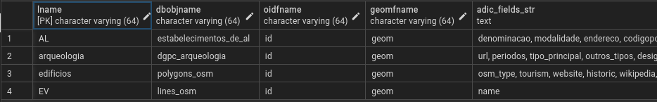

# RISCO PostGIS Deployment

RISCO Server PostgreSQL component

RISCO Server is a geographic feature server depending on PostgreSQL + PosGIS (vaguely similar to [pg_featserv](https://access.crunchydata.com/documentation/pg_featureserv/latest/)).

You can find RISCO Server web server appliance code repository [here](https://github.com/rpcavaco/riscosrv_v2).

As RISCO feature server is totally dependent on PostGIS, this repository holds necessary DDL and PL/pgSQL code. Please get the single installation script from this [link](https://github.com/rpcavaco/riscosrv_v2_pg/blob/main/for_deployment/risco_pg_deployment.sql).

## Installation

### Relevant items to check or resolve prior to installation

1. Installation script creates a **risco_v2** *schema*. This is NOT changeable, this *schema* name is called elsewhere in server code.

2. Script begins by creating a **risco_v2** user. This name is changeable. If you'll be changing this user name in script prior to installation, be certain you checked and changed all code accordingly, as this name is intensively used as procedure and table object owner.

3. Do not forget to allow **risco_v2** user (or the username you choose, in case you replaced it) GRANT SELECT on the relevant geotables you will want to expose through RISCO.

4. Do not forget to allow **risco_v2** user (or the username you choose, in case you replaced it) GRANT SELECT, INSERT, UPDATE, DELETE on the relevant geotables you will want to expose and edit through RISCO.

5. Installation script must be run with elevated permissions, either by a user with CREATE privilege on the given database or run by the **postgres** super user.

> [!CAUTION]  
> **risco_request** and **risco_request_geometry** tables are unlogged in order to offer lowest insert and select times. Specially risco_requst_geometry tends to have a VERY fast growth rate, possibly hitting MILLIONS of records in a typical use day. DON'T FORGET to provide a cleaning routine for both tables.

### Installing

Just use a database administration tool (pgAdmin, Adminer or similar) to execute the installation script on sufficiently elevated permssions.

### Configuring

#### Maps table

Table name: ***risco_map***

 

The **risco_map** table basically defines:

-  a 'mapname' (must be coincident with the webapp's 'mapname' on JSON [basic config](https://github.com/rpcavaco/riscojs_v2#basic-config-syntax-items) of RISCO JavaScript client);
-  'srid': a map's CRS (don't forget: only cartesian coordinates allowed)
-  'descr': a map's description, just for human reference

#### Layerview table

Table name: ***risco_layerview***

The **risco_layerview** table basically indicate geometry content tables to be seen in map.

It contains several fields.

Required fields:

- 'lname' (must be coincident with JUST ONE group key inside 'layers' collection on JSON **layers** config (link TBD) of RISCO JavaScript client);
- 'dbobjname': a database object (table, view, materialized view or set-returning functionwith at least one geometry column, without *schema* name)
- 'schema': schema name of database object
- 'oidfname': object id field name (default: 'objectid')
- 'geomfname': geometry field name to use (default: 'shape')
- 'inuse': boolean indicating layer is currently in use
- 'srid': layer's SRID (numerical part of CRS EPSG label)
- 'maps': array of mapnames where you need this layer to be shown
- 'is_function': boolean, true value indicates database object is a set-returning function
- 'editable': boolean, true value defines database object is editable

Other non required but frequently used fields:

- 'adic_flds_str': string containg comma split attribute field names (must check **layers** config (link TBD) of RISCO JavaScript client in order to get these exposed in map tips or info popups)

Feature edit support, required fields
('editable' field contains 'true'):

- 'gisid_field' (required): unique feature identifier (objectid is not a reliable identifier on many GIS platforms)
- 'accept_deletion': boolean indicating DELETE operation is accepted

Feature edit support, optional fields
('editable' field still must contain 'true'):

- 'editobj_schema': schema of alternate database object to recieve edits
- 'editobj_name': alternate database object name to recieve edits
- 'edit_user': array of login names for which edit operations are authorized
- 'mark_as_deleted_ts_field': hname of timestamp

### Automatically enable history records generation for all edit operations

When enabled, history records based editing prevents the deletion of any records. In this case, there are two fields, one to get automatic record creation timestamp, while the onder recieves record termination timestamp.

So, during a deletion, a record being deleted just recieves the temination timestamp.

During insertion, the created record just recieves record creation timestamp, record termination field is NULL.

During update, current record is deleted (recieves termination timestamp) and a new one is created (just record creation is filled).

Required fields
('editable' field still must contain 'true'):

- 'mark_as_deleted_ts_field': record termination or **mark-as-deleted** timestamp field (null for one record per each feature identifier value, if feature is active or 'not deleted', non NULL for each inactive or deleted record)
- 'creation_ts_field': record creation timestamp field  (always non NULL)

Filling of this fieldnames in **layerview** table should immediately trigger history records functionality in RISCO.

### Using a set-returning function as a vector feature source

(TBD)

