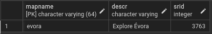

# RISCO PostGIS Deployment

RISCO Server PostgreSQL component

RISCO Server is a geographic feature server depending on PostgreSQL + PosGIS (vaguely similar to [pg_featserv](https://access.crunchydata.com/documentation/pg_featureserv/latest/)).

You can find RISCO Server web server appliance code repository [here](https://github.com/rpcavaco/riscosrv_v2).

As RISCO feature server is totally dependent on PostGIS, this repository holds necessary DDL and PL/pgSQL code. Please get the single installation script from this [link](https://github.com/rpcavaco/riscosrv_v2_pg/blob/main/for_deployment/risco_pg_deployment.sql).

## Installation

### Relevant items to check or resolve prior to installation

1. Installation script creates a **risco_v2** *schema*. This is NOT changeable, this *schema* name is called elsewhere in server code.

2. Script begins by creating a **risco_v2** user. This name is changeable. If you'll be changing this user name in script prior to installation, be certain you checked and changed all code accordingly, as this name is intensively used as procedure and table object owner.

3. Do not forget to allow **risco_v2** user (or the username you choose, in case you replaced it) GRANT SELECT on the relevant geotables you will want to expose through RISCO.

4. Do not forget to allow **risco_v2** user (or the username you choose, in case you replaced it) GRANT SELECT, INSERT, UPDATE, DELETE on the relevant geotables you will want to expose and edit through RISCO.

5. Installation script must be run with elevated permissions, either by a user with CREATE privilege on the given database or run by the **postgres** super user.

> [!CAUTION]  
> **risco_request** and **risco_request_geometry** tables are unlogged in order to offer lowest insert and select times. Specially risco_requst_geometry tends to have a VERY fast growth rate, possibly hitting MILLIONS of records in a typical use day. DON'T FORGET to provide a cleaning routine for both tables.

### Installing

Just use a database administration tool (pgAdmin, Adminer or similar) to execute the installation script on sufficiently elevated permssions.

### Configuring

#### Maps table

Table name: ***risco_map***

 

The **risco_map** table basically defines:

-  a 'mapname' (must be coincident with the webapp's 'mapname' on [basic config](rpcavaco/riscojs_v2#syntax-items)) of RISCO JavaScript client;
-  'srid': a map's CRS (don't forget: only cartesian coordinates allowed)
-  'descr': a map's description, just for human reference

